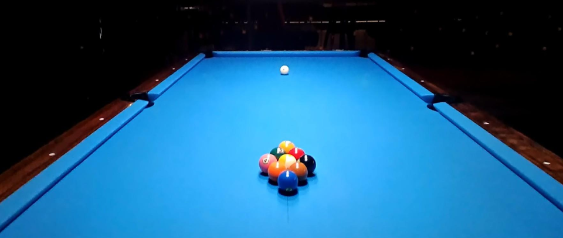

# 九球

九球（9-ball）是一种台球运动，又称花式九球。它在一个长方形的台球桌上进行，四个角和每条长边的中间都有袋口。玩家使用台球杆击打白色主球，以按升序编号的方式将九个彩色台球打入袋中。首先打入9号球的玩家赢得比赛的胜利。九球的规则多种多样，衍生出了十球、七球和三球等游戏。

九球的比赛里，母球必须在碰撞到其他子球前，先撞击到台面上数字最小的子球（push-out可不依从此规定），否则就是犯规。依上述原则下，子球可不必依照号码顺序进袋，只要母球先碰击到号码最小的子球即可。因为不必指定子球落袋的袋口，若选手将9号球幸运地打进任何袋口，即赢得胜利，开球时也是如此。比赛时，选手在失误（注：没进球）、犯规之前，可持续出杆，若犯规，必须交由对手出杆，对手拥有“自由球”，可在出杆前，在台桌上自由摆放母球的位置以利进攻。

**父类：**普尔台球

**子类：**

- 美式九球
- 中式九球

**变种：**

- 四球
- 七球
- 十球

**亚型：**中式九球常常有一种三人（或多人）的民间玩法，叫作“追分”，每名选手具有上家和下家，不同赢法对应不同的分值。
