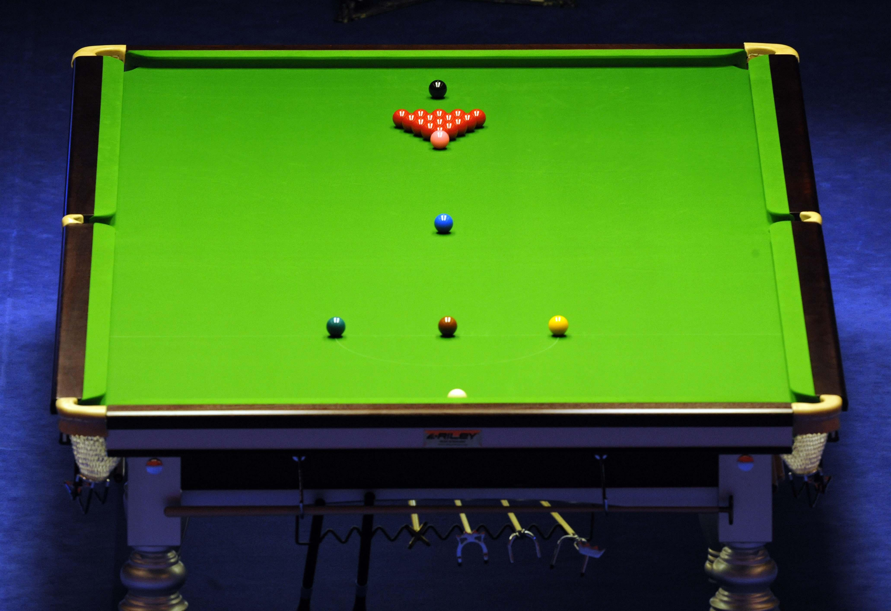

# 斯诺克

斯诺克（英语：Snooker），是一种落袋式台球运动。此项运动使用的球台长12英尺、宽6英尺(即长3.6576米，宽1.8288米)。台面四个角落以及两边长边中心位置各有一个球洞。台面上的球分别为一个主球，15个红球以及6个彩色球（依分数顺序为黄、绿、啡、蓝、粉、黑）。

比赛过程中，球手需利用球杆通过击打主球碰撞红球或彩色球令其入袋。球手必须以击打红球作为每一杆的开始，若红球顺利入袋，球手可以击打任一彩色球获取分数，若彩色球亦顺利入袋，球手可再选择击打一枚红球，以此类推，直到台面上所有的红球及彩球都全部落袋。然后，球手必须以黄、绿、啡、蓝、粉、黑的顺序逐个把彩色球入袋，得分最高的球手获胜。若球手该杆不能将任何红球或彩色球击入袋中，或是主球入袋，则该杆结束，交由对手击球。

**子类：**

- 英式斯诺克
- 中式斯诺克
- 美式斯诺克

