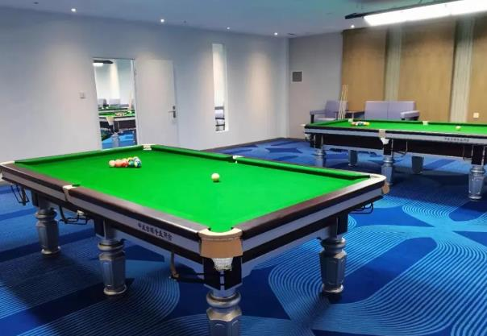

# 中式八球

中式八球（8-ball）是一种在有六个袋口的台球桌上进行的台球项目，使用台球杆和十六个台球（一个主球和十五个目标球）。目标球包括七个编号为1至7的实心球、七个编号为9至15的条纹球，以及黑色的8号球。在开球后，当某个玩家合法地将一颗目标球打入袋中时，他们将被分配为实心球或条纹球组。游戏的目标是在清除玩家所分配的球组后，将8号球合法地打入一个袋口。八球是世界范围内最流行的台球项目，通常被视为“台球”的代名词，有许多地区性的变种。

