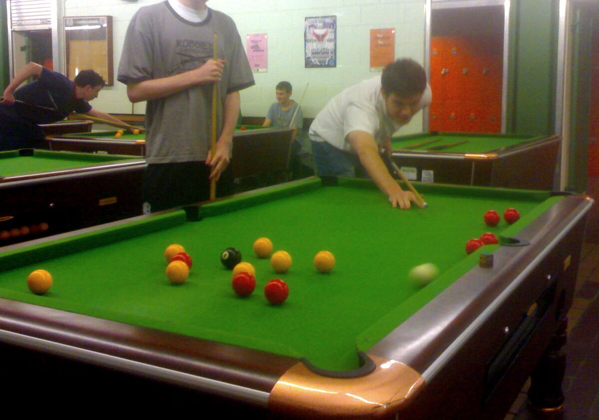

# 英式八球

### 规则版本

英式八球规则的传统版本为WEPF Eight-Ball，另一个略有不同的版本为WPA Black-Ball（注意WPA Eight-Ball为美式八球）。

- DAPTO/UKPF(1976-2004)
- EPA(1978-1998)
- WEPF(1998-2022)
- WPA(2004-)
- IEPF(2022-)

### 规则要点

1. 分球时同时打进两种颜色的球，不算分球；分球后的击球可以将两种颜色的球入袋，不犯规；但只有对手的球入袋，犯规
2. 开球需要有两球过中线；击球后必须有球碰库；但如果形成斯诺克局面，可以不碰库
3. 犯规后，对手获得两次击球：第一次是自由击球，可以选择母球在当前位置或摆至线后，允许击打任何目标球（调整母球位置/踢走对手的球），但不能提前打进黑球或不击打任何球；无论自由击球是否有球入袋，对手均可第二次击球（正常击打）
4. 允许将自己的球与黑球一起入袋，只要保证台面不留下自己的球
5. 不允许跳球；如果出现没有可能击打路径，则出现逼和（stalemate）