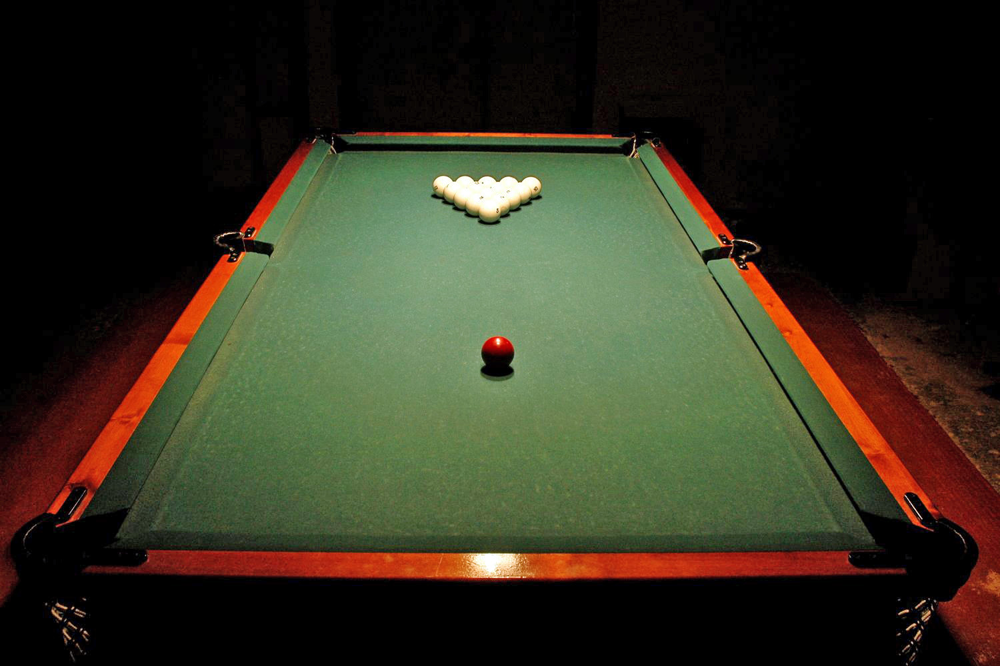

# 动态派俄式台球

俄式台球（Russian Pyramid），是一种落袋式台球，使用1颗红球，15颗编号为1至15的白球。球的直径68毫米，比花式台球的57毫米大了许多，也是所有台球运动尺寸最大者。正式比赛用球桌的大小，与斯诺克球桌相同，长12英尺、宽6英尺。但袋口非常小，只有1.1颗球宽。俄式台球由于使用最大的球桌、最小的袋口与最大颗的球，被认为是落袋式台球运动中，进球困难度最高的一种。

俄式台球有很多种不同的玩法，较常见的为自由（美）派、混合（莫斯科）派、动态（彼得堡）派三种赛制。不论上述何种赛制，开局前均将15颗号码球排列于三角框内。开球者撞击置于发球线的母球，令其撞开号码球堆。击球者不管打进母球或子球，都算得分，并可继续击球；否则换对手击球。一局比赛以率先打进8颗球者为胜，正规的比赛通常定为抢7局以上。

在**动态派**赛制里，红色是唯一的母球，因此红球进袋后，必须拾回并重新放回球台上，并由进球者指定移除台面上的一颗白球。可将拾回的母球放置于球台上任何位置，但次一球母球进袋不算得分。

