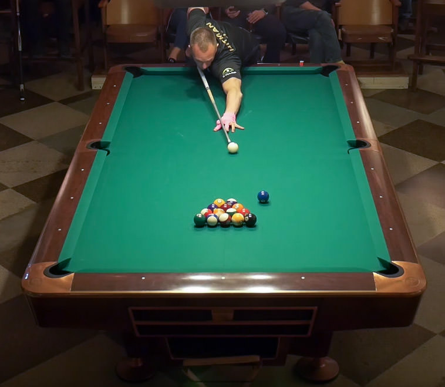

# 直球

直球（Straight Pool），也称为14-1连续击球，是一种台球运动，其中两名竞争玩家尝试在不犯规的情况下尽可能多地将目标球打入袋中。在直球游戏中，玩家可以声明并尝试将台面上的任何目标球打入袋中，无论其编号或颜色，直到只剩下一个目标球和主球，此时其余的十四个球会重新排列。此时，比赛恢复，目标是将剩下的球打入袋中，使主球反弹入重新排列的球中，散开球并允许玩家继续击球。目标是在比赛开始前商定的分数（通常为100分）内获胜。

打入目标球得1分，而所有犯规行为都将扣除1分，而球员如果连续三次犯规，则会被额外扣除15分。在开球时，要么母球和两个其他球必须碰到库边，要么必须有一个球被打入袋中。如果未能满足这两个条件中的任何一个，则视为犯规。首次开球犯规会受到罚2分的处罚。

**父类：**普尔台球
