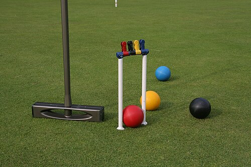

# 地面台球

地面台球是现代对一系列中世纪欧洲草坪游戏的统称，这些游戏的原始名称大多已不可考。游戏使用长柄球槌（权杖）、木球、球门（传球圈）和立柱（国王）。台球运动史学家称其为“台球的起源”，并由此发展出多种现代室内外运动，例如槌球、美式台球、斯诺克和开仑台球。

这种原始台球游戏似乎是槌球（19世纪）、特鲁科（17世纪；也称卡车台球或草坪台球）、帕尔马尔台球16世纪）、马球（15世纪）以及室内台球运动（至少15世纪，甚至更早——通常指今天的台球运动）的祖先。