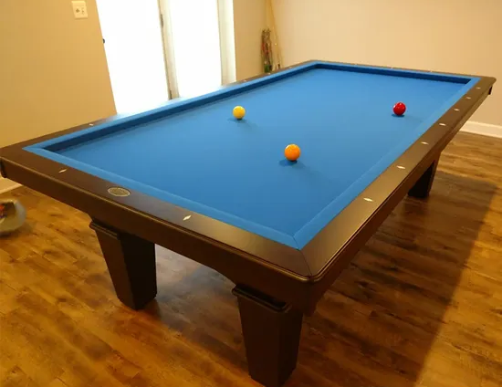

# 开仑台球

开仑台球（Carom），也称法式台球，是一种球桌没有袋口的台球运动。开仑台球有多种竞赛方式，其共同点是使用台球杆来撞击母球，令其在台球桌上滚动并撞击其他球，以达成特定目的而得分。

早期的竞赛项目为四球竞赛与三球竞赛，两者规则一样，只是球数不同而已。选手击球后，只要令母球先后撞及两颗子球即可得分。后来因为发明了赛利撞法，让母球及两颗子球持续集中在一个小范围内，不断地撞击得分，因而创造惊人的高分，失去竞赛意义。

为了挽救开仑台球运动，于是各种改革方案因应而生：第一类是限制在某些区域内的击球次数，例如自由球竞赛及各种障碍线竞赛；第二类是额外要求母球或子球碰撞桌边（Cushion，音译“颗星”）以增加困难度，例如一颗星竞赛及目前最受重视的三颗星竞赛；第三类是规定母球或子球要通过球台上的特定位置，例如五针竞赛、九针竞赛等。

**子类：**

- 自由球
- 障碍线
- 一颗星
- 三颗星
- 五瓶
- 九瓶

**亚型：**五瓶、九瓶也属于瓶式台球的一种子类。
