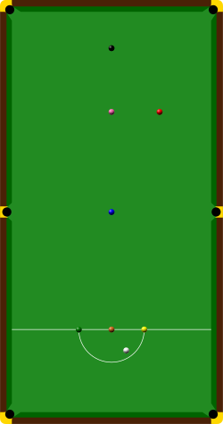

# 巴西斯诺克

巴西斯诺克（葡萄牙语：Sinuca Brasileira）是一种在斯诺克桌上进行的台球运动，其特点是使用一颗红球，同时保留标准斯诺克的六颗彩球，每颗球的分值与斯诺克相同。所有的犯规和罚分都是7分，如果母球落袋，则对手获得手中球。在比赛中，玩家可以选择两种击球模式：

- Free Shot：第一次Free Shot只能击打台面上分值最低的球，如果打进则得分并且不再复位，如果未打进也不罚分。如果第一次Free Shot成功，可以获得第二次Free Shot。第二次Free Shot可以选择任意分值的球，如果打进则得分并且复位，如果未打进依然不罚分。如果成功第二次Free Shot成功，则可以选择进行第一次Free Shot或者进行Penalty Shot。
- Penalty Shot：可以击打台面上任意分值的球，如果打进则得分并且复位；如果未打进则罚分给对手。如果Penalty Shot成功，则接下来只能选择Free Shot。

**父类：**英式台球
