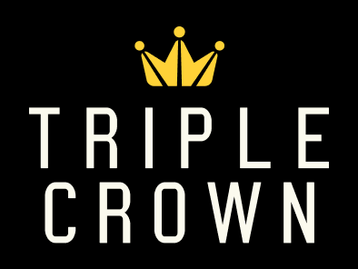

# 满贯球员

在世界斯诺克巡回赛体系下，获得英国锦标赛、大师赛、世界锦标赛这三大赛的球员被称为大满贯（Triple Crown）。

|                     球员                     | 三大赛冠军 | 英锦赛 | 大师赛  | 世锦赛 |  持续时间  |   达成时间   |    单赛季三大赛      | 排名赛冠军  |
| :------------------------------------------: | :-------: | :----: | :----: | :----: | :-------: | :---------: | :-----------------: | :--------: |
|     史蒂夫·戴维斯      |     15    |   6    |   3    |   6    | 1980-1997 | 1982年大师赛 |          0          |    28      |
|      泰瑞·格里菲斯       |     3     |   1    |   1    |   1    | 1979-1982 | 1982年英锦赛 |          0          |    1       |
| 亚历克斯·希金斯  |     5     |   1    |   2    |   2    | 1972-1983 | 1983年英锦赛 |          0          |    1       |
|    斯蒂芬·亨得利      |     18    |   5    |   6    |   7    | 1989-1999 | 1990年世锦赛 | 2(1989-90, 1995-96) |    36      |
|   **约翰·希金斯**    |     9     |   3    |   2    |   4    | 1998-2011 | 1999年大师赛 |          0          |    33      |
|    **马克·威廉姆斯**    |     7     |   2    |   2    |   3    | 1998-2018 | 2000年世锦赛 |     1(2002-03)      |    27      |
|   **罗尼·奥沙利文**   |     23    |   8    |   8    |   7    | 1993-2024 | 2001年世锦赛 |          0          |    41      |
|   **尼尔·罗伯逊**   |     6     |   3    |   2    |   1    | 2010-2022 | 2013年英锦赛 |          0          |    26      |
|    **马克·塞尔比**    |     10    |   3    |   3    |   4    | 2008-2025 | 2014年世锦赛 |          0          |    25      |
|     **肖恩·墨菲**     |     4     |   1    |   2    |   1    | 2005-2025 | 2015年大师赛 |          0          |    13      |
|   **贾德·特鲁姆普**   |     5     |   2    |   2    |   1    | 2011-2024 | 2019年世锦赛 |          0          |    31      |

*\* 现役球员**加粗**表示*