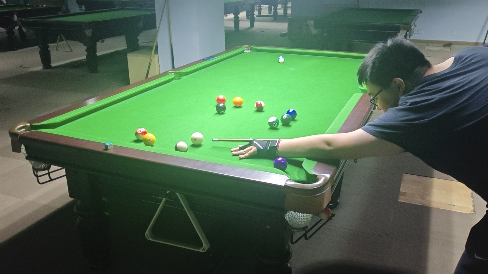

# 王翰墨的台球主页

### 2026年斯诺克世界锦标赛

- [Link](./4-Tournaments/三大赛/06-2026年世锦赛.md)

<b>Upcoming Matches</b>

| 比赛日  |   时间段  |                    选手A                       |                   选手B                        |     轮次      |      阶段     |
| :-----: | :------: | :--------------------------------------------: | :--------------------------------------------: | :----------: | :----------: |
| 4月29日 |   17:00  |  约翰·希金斯(3)          |  尼尔·罗伯逊(5)         |    1/4决赛    |    第2阶段   |
| 4月29日 |   17:00  |  马克·艾伦(8)       |  巴里·霍金斯(8)           |    1/4决赛    |    第3阶段   |
| 4月29日 |   21:30  |  赵心童(8)                  |  肖恩·墨菲(8)             |    1/4决赛    |    第3阶段   |
| 4月29日 |   21:30  |  吴宜泽(4)                  | 侯赛因·瓦菲(4)               |    1/4决赛    |    第2阶段   |
| 4月30日 |   02:00  |  约翰·希金斯(3)          |  尼尔·罗伯逊(5)         |    1/4决赛    |    第3阶段   |
| 4月30日 |   02:00  |  吴宜泽(4)                  | 侯赛因·瓦菲(4)               |    1/4决赛    |    第3阶段   |