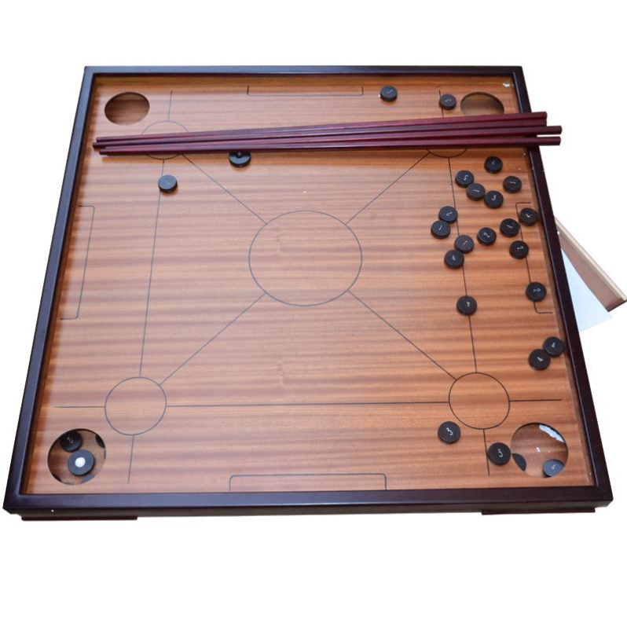

# 康乐球

康乐球（Novuss/Korona），又名康乐球、克郎球、克郎棋，是一项技巧性的撞击球运动，使用球杆将球打入球台四角的洞内，以达成特定目的，打法与规则类似于台球。

康乐球球台为正方形，四角有四个圆形的球洞，下方为储存盒，球台下面用交叉的木架支撑。球台四边是一寸多高的框，球盘高度可以调节，以到胸口为宜。球盘的球洞旁有四个白圈，为射球子的位置，圈与圈之间有四条线连成一四方形，中心另有一白圈。球杆为笔直的，有一米多长，一端如小指细，另一端有拇指粗。在中国大陆，球子为有四种颜色或四种标记的中国象棋子球状圆扁形球子各8枚，共32枚，大小厚如手指。在香港，子球则共有36只，其中红绿子球各16只，另有4只母球用作射棋之用。

康乐球通常供两人同时进行，也可根据喜好由若干人组成两队对战。而两队（或两人）玩家会站在成平衡线的其中两侧。玩家手持球杆用母球去撞击对家颜色的子球，谁率先将全部球子打入洞中便是赢家。打法可将球子集中在球盘中，还可将球子紧贴在球盘边上，互击对方的球子。

