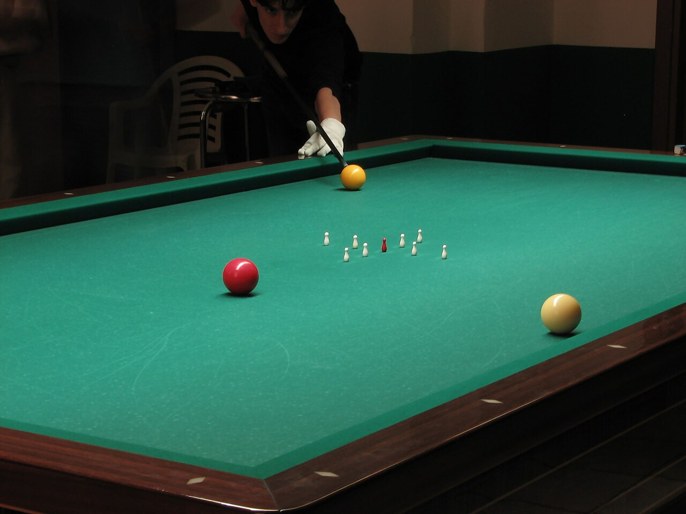

# 瓶式台球

瓶式台球是一种在球台中央放置若干个瓶子的台球运动，其击球目的是让母球碰撞对方的母球，令其本身或再碰撞的子球碰倒瓶子以得到分数。该玩法主要分为两个分支：在无袋口台球桌上进行的又称为意式台球，主要有五瓶、九瓶等玩法，流行于意大利、阿根廷等地，也属于开仑台球的一种。在有袋口台球桌上进行的又称为丹麦瓶式台球，流行于丹麦地区。

**子类：**

- 五瓶
- 九瓶
- 丹麦瓶式台球

**亚型：**五瓶、九瓶也属于开仑台球的一种子类。

