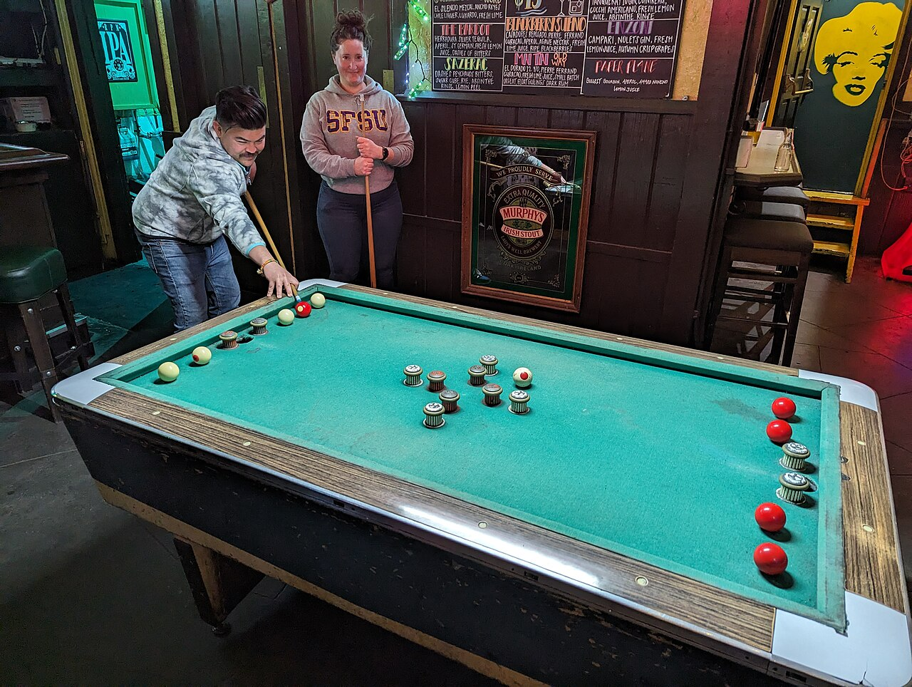

# 弹障台球

弹障台球（Bumper Pool）在结构上类似于迷你版的常规台球桌，可以是矩形或八角形。桌面盖布与边框类似传统台球，但中央和靠近袋口的位置布置有固定障碍物（bumpers）。每位玩家拥有 5 颗球（通常为红色和白色），其中一颗带标记，初始摆在自己目标袋对面的一侧。目标是把所有自己的球踢入对方的一个特定袋口中。与普通台球不同，玩家可直接用球杆击打任意一颗球（没有专用的母球）。游戏开始时，两名玩家同时击打带标记的球，后续轮流击球，连续入袋可继续击打。

